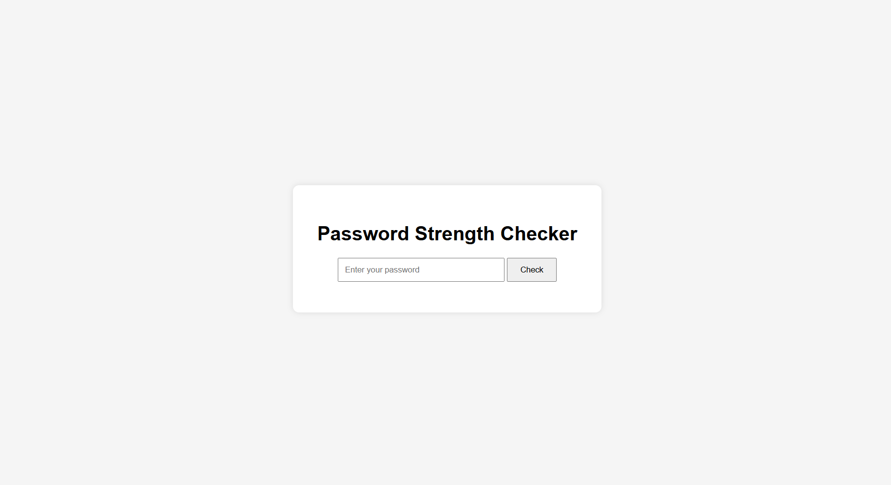

# Hi, I'm Atul Kumar👋

**B.Tech CSE | AI & ML Enthusiast | Cybersecurity & Ethical Hacker**

Welcome to my GitHub! I build AI/ML projects, explore data science, and practice ethical hacking. I enjoy creating tools that solve real-world problems and sharing knowledge with the community.

---

## 🛠️ Skills & Tools

---

## 📂 Projects

### 1. Sentiment Analyzer Demo
  
**Description:** Web-based AI/ML demo predicting text sentiment (Positive, Negative, Neutral).  
  

---

### 2. Password Strength Checker
  
**Description:** Flask app to check password strength in real-time.  

---

### 3. Phishing URL Detector
  
**Description:** Detects phishing URLs using Python & ML.  

---

## 📊 GitHub Stats

---

## 🏆 Certifications

---

## 📫 Contact Me
  
  

---

Thanks for visiting my profile! 😊
